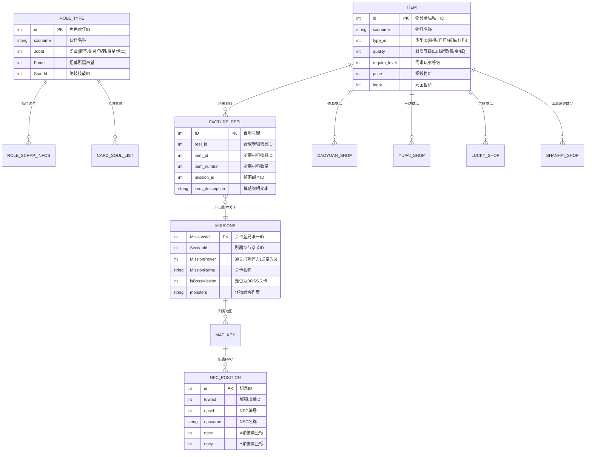

# 神仙道本地元数据库 (Pieb.db) 全量数据字典

> [!NOTE]
> 本文档定义了项目本地挂载的 `data/Pieb.db`（SQLite 3 数据库，包含 37 张表、数万条静态元数据）的完整实体关系图、数据字典与 Go 数据仓储（`internal/dictionary`）映射规范。

---

## 一、 实体关系全景图 (Entity-Relationship Diagram)



---

## 二、 37 张数据表全量分类索引

| 业务领域分类 | 包含表名 | 记录条数 | 自动化业务用途与职责 |
| :--- | :--- | :--- | :--- |
| **物品、装备与配方** | `item` | 8,178 | 全局物品元数据字典（装备、丹药、材料、礼包） |
| | `factureReel` | 2,265 | 卷轴合成配方及材料关卡掉落映射（推导扫荡目标） |
| | `FiveElementsEquip` | 15 | 五行装备阶数、属性及分解经验规则 |
| | `DragonBall` | 63 | 龙珠技能、星级与解封消耗龙魂字典 |
| | `DragonBallResource`| 6 | 龙珠强化与分解资源定义 |
| | `TowerAwardList` | 8 | 爬塔奖励掉落配置 |
| **关卡、寻路与任务** | `Missions` | 1,966 | 全量副本地图关卡、体力消耗与怪物配置 |
| | `Quests` | 1,937 | 主线、支线与日常任务接取/交付 NPC 字典 |
| | `NPCposition` | 424 | 全城镇 NPC 寻路二维空间坐标字典 |
| | `NPCQuest` | 20 | 场景随机事件问答与答案索引 |
| | `Mapkey` | 23 | 场景大地图与城镇名称映射字典 |
| | `hidemap` | 157 | 隐藏关卡与隐藏副本判定表 |
| | `ImmortalFantasy` | 61 | 虚空幻境副本序列与掉落配置 |
| **角色、伙伴与养成** | `roletype` | 577 | 全伙伴基础属性、职业、招募声望与绝技 |
| | `fatetype` | 100 | 命格品质、战斗属性加成与升级经验规则 |
| | `cardSoulList` | 72 | 伙伴卡魂兑换与分解碎片比率 |
| | `soulList` | 67 | 伙伴缘魂属性配置 |
| | `RoleScrapInfos` | 18 | 特殊神级伙伴（如斗战胜佛）碎片兑换需求 |
| | `PlayerTitles` | 201 | 玩家称号及战力加成表 |
| | `PartnerExpeditionmission` | 8 | 伙伴远征派遣任务星级与奖励 |
| | `guespar` | 61 | 伙伴猜拳活动角色映射 |
| **商店、兑换与集市** | `daoyuanshop` | 54 | 道源商店物品、限购数量与货币定价 |
| | `yupaishop` | 13 | 白/绿/蓝/紫/黄玉牌商店兑换物字典 |
| | `luckyshop` | 125 | 吉祥如意杂货铺物品与刷新权重 |
| | `StShanhaiShop` | 14 | 山海遗迹积分商店物品与每日限购 |
| | `newShopGoods` | 16 | 新版积分限购商城货架配置 |
| | `WorldPKExchange` | 12 | 跨服战积分兑换奖池 |
| | `wishpoolaward` | 35 | 许愿池奖品池与概率分布 |
| | `IdentifyTreasureaward` | 37 | 鉴宝活动奖励表 |
| **日常活动与社交** | `ActivityArray` | 260 | 全局限时活动标识、枚举与活动名称对照 |
| | `ChallengeType` | 58 | 世界 BOSS、帮派神兽等挑战怪物定义 |
| | `MascotBefall` | 25 | 福神降临 Buff 类型与增益比例 |
| | `StEightImmortalsType` | 24 | 八仙过海活动阵法与属性增益表 |
| | `Furinkazan` | 17 | 风林火山活动关卡阶段配置 |
| | `serchat` | 19 | 闲聊频道分流服务器配置 |
| | `relicPoint` | 52 | 遗迹积分与传送节点映射 |

---

## 三、 核心业务表详述 (Core Schemas)

### 3.1 物品字典表 (`item`)
全游戏静态资产基石，所有商店、掉落、扫荡均通过 `id` 进行关联：

```sql
CREATE TABLE item (
    id            INTEGER PRIMARY KEY, -- 物品唯一标识
    sxdname       TEXT    NOT NULL,    -- 物品名称 (如 "气血包", "紫幽羽")
    type_id       INTEGER NOT NULL,    -- 物品类型码 (装备=1~6, 丹药=10001, 卷轴=11000 等)
    description   TEXT,                -- 描述说明文本
    quality       INTEGER NOT NULL,    -- 品质 (0=白, 1=绿, 2=蓝, 3=紫, 4=金, 5=暗金, 6=红)
    require_level INTEGER DEFAULT 1,   -- 佩戴/使用最低角色等级
    price         INTEGER DEFAULT 0,   -- 卖店铜钱价格
    ingot         INTEGER DEFAULT 0,   -- 商城元宝定价
    special_gift_tip TEXT              -- 特殊礼包打开提示
);
```

### 3.2 副本关卡字典表 (`Missions`)
驱动自动扫荡、主线推图与体力消耗计算的核心表：

```sql
CREATE TABLE Missions (
    MissionsId    INTEGER PRIMARY KEY, -- 关卡唯一标识 (如 1="浮月林道(1)", 105="扬州城-万妖皇")
    SectionId     INTEGER NOT NULL,    -- 章节序号 (1=小渔村, 2=苏州城, 3=京城...)
    MissionLock   INTEGER DEFAULT 0,   -- 解锁所需前置任务标记
    MissionPower  INTEGER DEFAULT 5,   -- 单次挑战消耗体力 (标准为 5 点)
    map           INTEGER,             -- 地图背景资源编号
    mapkey        INTEGER,             -- 关联 Mapkey 城镇索引
    MissionName   TEXT    NOT NULL,    -- 关卡全名
    MissionType   INTEGER DEFAULT 0,   -- 关卡类型 (0=普通关卡, 1=精英副本)
    isBossMission INTEGER DEFAULT 0,   -- 是否为章节 BOSS 关卡 (1=是, 0=否)
    monsters      TEXT                 -- 怪物组合字符串 (如 "1,2,3")
);
```

### 3.3 卷轴材料合成表 (`factureReel`)
驱动“智能材料扫荡”的关键推导表。当用户指定打造某件紫装/金装时，算法以此表自动推导所需刷取的关卡：

```sql
CREATE TABLE factureReel (
    ID               INTEGER PRIMARY KEY AUTOINCREMENT,
    reel_id          INTEGER NOT NULL, -- 卷轴本身的物品 ID (关联 item.id)
    item_id          INTEGER NOT NULL, -- 所需基础合成材料物品 ID (关联 item.id)
    item_number      INTEGER NOT NULL, -- 所需材料数量
    item_description TEXT,             -- 掉落说明 (如 "幽花林(1)掉落")
    mission_id       INTEGER NOT NULL  -- 产出该材料的最佳关卡 ID (关联 Missions.MissionsId)
);
```

### 3.4 城镇 NPC 坐标表 (`NPCposition`)
驱动跨图移动与自动 NPC 交互（交接任务、仙境结交、进入副本）的空间坐标字典：

```sql
CREATE TABLE NPCposition (
    id      INTEGER PRIMARY KEY,
    townid  INTEGER NOT NULL, -- 城镇城镇编号 (1=小渔村, 2=苏州, 5=扬州...)
    npcid   INTEGER NOT NULL, -- NPC 角色编号
    npcname TEXT    NOT NULL, -- NPC 姓名 (如 "村长", "芸娘", "神秘商人")
    npcx    INTEGER NOT NULL, -- 二维 X 轴像素绝对坐标
    npcy    INTEGER NOT NULL  -- 二维 Y 轴像素绝对坐标
);
```

---

## 四、 Go 语言工程接入规范 (`internal/dictionary`)

在 Go 项目中通过纯 Go SQLite 驱动（避免跨平台 CGO 编译依赖）挂载 `data/Pieb.db`：

1. **只读挂载保护**：
   ```go
   // 必须使用只读模式打开，防止多进程写入引发 SQLite 锁死或原版资产损坏
   dbURI := "file:data/Pieb.db?mode=ro&cache=shared"
   db, err := sql.Open("sqlite", dbURI)
   ```
2. **内存热缓存策略**：
   - 数据量小于 500 条的小字典（如 `NPCposition`、`fatetype`、`DragonBall`、`Mapkey`）在系统启动时一次性加载为 `map[int]*Entity`，实现 $O(1)$ 寻址。
   - 数据量较大的 `item`（8,178 条）与 `factureReel`（2,265 条）建立预编译 SQL 语句（`sql.Stmt`）按主键及索引索引检索。
