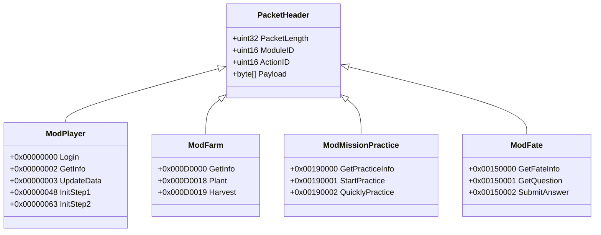

# 神仙道二进制网络协议规范白皮书 (Protocol Specification)

> [!NOTE]
> 本规范基于原版客户端（`pie.exe`）逆向推演与抓包文件 `sxd.pcapng`（5,328 条 TCP 交互封包）一手数据对齐编制。定义了客户端与游戏服务器、跨服服务器间通信的物理帧格式、数据类型编解码规则与 Golden Packet 黄金测试用例。

---

## 一、 协议层级与物理帧结构 (Frame Structure)

神仙道网络通信基于 **TCP 流式长连接**，应用层采用源自 ActionScript 3 ByteArray 的**大端序（Big-Endian / 网络字节序）私有二进制流协议**。

### 1.1 定长包头布局 (Header Layout)

每个通信封包以固定的 **8 字节包头** 起始，后接动态长度的应用层载荷（Payload）：

```
 0                   1                   2                   3
 0 1 2 3 4 5 6 7 8 9 0 1 2 3 4 5 6 7 8 9 0 1 2 3 4 5 6 7 8 9 0 1
+-+-+-+-+-+-+-+-+-+-+-+-+-+-+-+-+-+-+-+-+-+-+-+-+-+-+-+-+-+-+-+-+
|                       Packet Length (4B)                      |
+-+-+-+-+-+-+-+-+-+-+-+-+-+-+-+-+-+-+-+-+-+-+-+-+-+-+-+-+-+-+-+-+
|          Module ID (2B)       |          Action ID (2B)       |
+-+-+-+-+-+-+-+-+-+-+-+-+-+-+-+-+-+-+-+-+-+-+-+-+-+-+-+-+-+-+-+-+
|                                                               |
|                   Payload Data (Length - 4 Bytes)             |
|                                                               |
+-+-+-+-+-+-+-+-+-+-+-+-+-+-+-+-+-+-+-+-+-+-+-+-+-+-+-+-+-+-+-+-+
```

| 字段名称 | 字节大小 | 字节序 | 描述与约束 |
| :--- | :--- | :--- | :--- |
| **Packet Length** | 4 字节 (uint32) | Big-Endian | 载荷长度声明。等于后续字节总数（`2B Module + 2B Action + Payload 长度`）。TCP 粘包半包以此为界。 |
| **Module ID** | 2 字节 (uint16) | Big-Endian | 业务模块编号（如角色模块=0，副本扫荡=25，药园=13 等）。 |
| **Action ID** | 2 字节 (uint16) | Big-Endian | 模块内部指令编号（如登录握手=0，进入城镇=0，提交答案=2 等）。 |
| **Payload** | 可变长 | - | 具体指令参数序列，或经过透明 zlib 压缩的二进制流。 |

> [!IMPORTANT]
> **ActionID 合成规范**：在 Go 实现中，`uint32` 类型的统一 `ActionID` 由高 16 位 Module 与低 16 位 Action 组合而成：
> `ActionID = (uint32(Module) << 16) | uint32(Action)`

---

## 二、 基本数据类型序列化规范 (Type Marshalling)

Payload 中的字段无任何分隔符，严格按照指令接口签名紧凑排列：

### 2.1 基础数值类型 (Primitives)
- **`Int8 / UInt8`**：单字节直接读取。
- **`Int16 / UInt16`**：2 字节大端序（`binary.BigEndian.Uint16`）。
- **`Int32 / UInt32`**：4 字节大端序（`binary.BigEndian.Uint32`）。
- **`Int64 / UInt64`**：8 字节大端序。

### 2.2 变长字符串 (String)
- **编码格式**：前缀 2 字节无符号整数（表示 UTF-8 字节串长度），后随原始字节：
  ```
  [2 字节 Length (Big-Endian)] + [Length 字节的 UTF-8 文本]
  ```
- **示例**：字符串 `"kongyu"` 编码为 `00 06 6b 6f 6e 67 79 75`。

### 2.3 数组与列表 (Array / List)
- **编码格式**：前缀 2 字节（或根据接口定义的 4 字节）元素个数 `Count`，后随 `Count` 个相同结构的实体连续编码：
  ```
  [2 字节 Count] + [Item_1] + [Item_2] + ... + [Item_Count]
  ```

### 2.4 透明流式 zlib 压缩 (Compression Protocol)
当单包响应数据体较大（如大地图数据、全服公告、全量背包列表）时，服务端会对整个 Payload（或从 ActionID 之后的数据）执行标准 Deflate 压缩：
- **特征魔数**：首字节为 `0x78`（标准 zlib CMF 头部，常见 `0x78 0x9C`、`0x78 0x01`、`0x78 0xDA`）。
- **解码自愈契约**：客户端嗅探到 `0x78` 时尝试 `zlib.NewReader` 解压；若解压缩中途报错，降级为原始未压缩字节，防止非压缩数据的误判崩溃。

---

## 三、 基于真实抓包 (`sxd.pcapng`) 的黄金报文对照

以下测试用例直采自项目根目录下 `sxd.pcapng` 的真实网络流，作为 Go `protocol/codec.go` 单元测试的 Golden Cases。

### 3.1 客户端登录请求包 (Golden Case 1: Player Login)
- **抓包来源**：`192.168.3.6:9826 -> 49.232.196.100:8381`（Frame 1）
- **协议分类**：`Module 0` (Player), `Action 0` (Login)
- **原始报文字节流 (116 字节)**：
  ```hex
  00 00 00 70 00 00 00 00 00 06 6b 6f 6e 67 79 75
  00 20 38 62 33 61 39 34 61 62 39 33 33 62 33 36
  39 39 39 63 65 65 31 32 30 38 65 35 34 32 64 64
  39 31 00 00 00 00 67 06 82 89 00 00 00 00 00 20
  38 62 33 61 39 34 61 62 39 33 33 62 33 36 39 39
  39 63 65 65 31 32 30 38 65 35 34 32 64 64 39 31
  00 0c 66 65 6e 67 77 61 6e 79 78 5f 73 38 31 33
  00 02 77 64
  ```
- **逐字段解构剖析**：
  1. `00 00 00 70`：`Packet Length = 112`（后续 112 字节，整包 116 字节）。
  2. `00 00`：`Module ID = 0`（角色主模块）。
  3. `00 00`：`Action ID = 0`（登录指令）。
  4. `00 06 6b 6f 6e 67 79 75`：字符串 `Username = "kongyu"`（长度 6）。
  5. `00 20 38 62 33 61 ...`：字符串 `Hash = "8b3a94ab933b36999cee1208e542dd91"`（32 字节 MD5 凭据）。
  6. `00 00 00 00 67 06 82 89`：时间戳与校验参数。
  7. `00 20 ...`：第二重鉴权 Hash。
  8. `00 0c 66 65 6e 67 77 61 6e 79 78 5f 73 38 31 33`：区服标识字符串 `ServerID = "fengwanyx_s813"`（长度 12）。
  9. `00 02 77 64`：客户端标识字符串 `ClientType = "wd"`（微端模式，可领取专属奖励）。

### 3.2 服务端登录成功响应包 (Golden Case 2: Login Response)
- **抓包来源**：`49.232.196.100:8381 -> 192.168.3.6:9826`（Frame 5）
- **协议分类**：`Module 0` (Player), `Action 0` (Login Response)
- **原始报文字节流 (30 字节)**：
  ```hex
  00 00 00 1a 00 00 00 00 00 00 00 00 04 0a 00 00
  00 00 00 00 00 00 01 00 0b 00 00 10 85 01
  ```
- **逐字段解构剖析**：
  1. `00 00 00 1a`：`Packet Length = 26`。
  2. `00 00 00 00`：`Module = 0, Action = 0`。
  3. `00 00 00 00`：预留位。
  4. `04`：`Result Code = 4`（**4 代表登录认证成功**，对齐运行日志 `[10:04:23] 登陆游戏服务器成功4`）。
  5. `0a 00 00 00 00 00 00 00 01`：角色 ID 与基础属性标志位。

### 3.3 角色初始化握手步 1 (Golden Case 3: Init Step 1)
- **客户端发包 (12 字节)**：
  `00 00 00 08 00 00 00 48 00 00 00 00`
  - `Length = 8`, `Module = 0`, `Action = 0x0048 (72)`（`ActionIDPlayerInitStep1`），参数为 `int32(0)`。
- **服务端响应 (22 字节)**：
  `00 00 00 12 00 00 00 48 00 00 13 0f 00 02 00 00 13 0f 00 00 13 12`
  - 返回玩家当前所处城镇场景编号（如当前城镇 ID 与分线）。

---

## 四、 核心业务模块与指令协议字典



### 4.1 Module 0: 角色核心模块 (`Mod_Player_Base`)
- `0x00000000 (0, 0)`：角色主服握手登录（携带 Username, Token, ServerID）。
- `0x00000002 (0, 2)`：查询角色基础信息（铜钱、元宝、体力、阅历、等级）。
- `0x00000003 (0, 3)`：服务端主动推送角色数据变更（体力增长、数值更新）。
- `0x00000048 (0, 72)`：角色初次进场同步城镇数据步 1。
- `0x00000063 (0, 99)`：角色初次进场同步城镇数据步 2。

### 4.2 Module 13 (0x0D): 药园农场模块 (`Mod_Farm_Base`)
- `0x000D0000 (13, 0)`：查询药园全量土地状态（是否开垦、作物类型、成熟剩余时间）。
- `0x000D0018 (13, 24)`：种植指定作物（参数：土地编号 `SoilID`、种子编号 `SeedID`、伙伴编号 `RoleID`）。
- `0x000D0019 (13, 25)`：收获成熟作物（参数：土地编号 `SoilID`）。

### 4.3 Module 21 (0x15): 仙履奇缘答题 (`Mod_Fate_Base`)
- `0x00150000 (21, 0)`：查询仙履奇缘剩余奇遇次数与冷却状态。
- `0x00150001 (21, 1)`：触发随机奇遇，服务端下发题目文本与 2 个选项。
- `0x00150002 (21, 2)`：提交选择答案（参数：题目 ID、所选选项 `OptionIndex` 1 或 2）。

### 4.4 Module 25 (0x19): 关卡推图与扫荡 (`Mod_MissionPractice_Base`)
- `0x00190000 (25, 0)`：获取关卡扫荡当前状态与挂机队列。
- `0x00190001 (25, 1)`：发起常规关卡体力扫荡（参数：关卡编号 `MissionID`、扫荡次数 `Times`）。
- `0x00190002 (25, 2)`：使用扫荡券或元宝一键加速立即完成扫荡。

### 4.5 Module 28 (0x1C): 竞技场模块 (`Mod_Arena_Base`)
- `0x001C000C (28, 12)`：查询当前玩家排名与挑战冷却时间。
- `0x001C000D (28, 13)`：查询今日剩余免费挑战次数。
- `0x001C0000 (28, 0)`：获取可挑战对手列表（包含对手排位、战力与角色名）。
- `0x001C0001 (28, 1)`：向指定排位对手发起挑战。

### 4.6 Module 94 (0x5E): 跨服网关模块 (`Mod_StLogin_Base`)
- `0x005E0000 (94, 0)`：向仙界跨服网关发送二次鉴权（参数：`Time1`, `Hash1`）。
- `0x005E0001 (94, 1)`：进入仙界主城镇。
