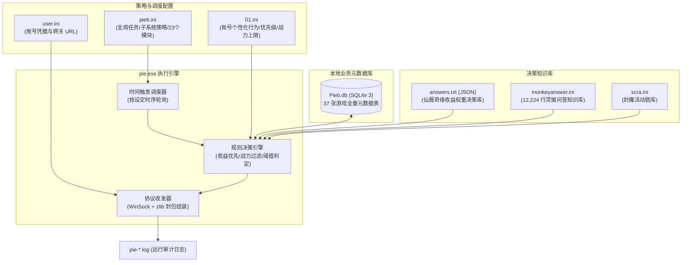
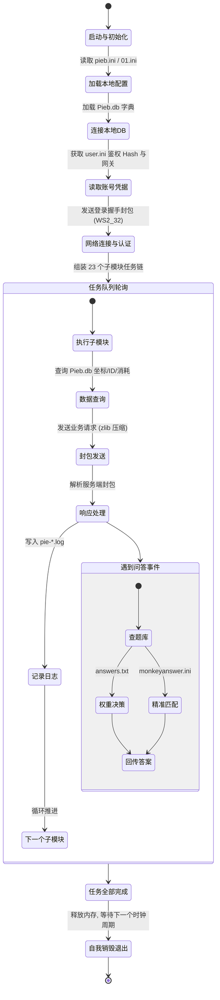

# 神仙道挂机套件 (pie.exe) 数据模型与自动化规则引擎深度解析

> [!NOTE]
> 本报告针对 **方案 B（数据与逻辑分析）** 展开，系统性剖析 `Pieb.db`（SQLite 3 数据库）、`pieb.ini` / `01.ini`（规则调度引擎）、`monkeyanswer.ini` / `answers.txt`（决策题库）的内部数据模型与业务自动化控制流。

---

## 一、 数据驱动自动化架构全景

`pie.exe` 的本质是一个高度解耦的**数据驱动型脱机协议机器人（Data-Driven Headless Bot）**。程序逻辑并不硬编码游戏数值，而是将游戏元数据、规则策略与知识库分别解耦至本地文件：



---

## 二、 本地元数据库 `Pieb.db` 核心模型解析

`Pieb.db` 内置 37 张表，涵盖神仙道页游全套基础数据，构成了辅助进行本地寻路、装备合成推导与商店买卖的离线字典：

### 2.1 装备、物品与材料掉落链（自动刷副本核心）
- **`item` 表（8,178 条记录）**：
  - 核心字段：`id`, `sxdname`, `type_id`, `quality`, `require_level`, `price`, `ingot`。
  - 作用：全局物品字典。定义全游戏消耗品、武器、防具、碎片与材料的品质等级。
- **`factureReel` 表（2,265 条记录）**：
  - 核心字段：`ID`, `reel_id`（卷轴ID）, `item_id`（所需材料ID）, `item_number`（所需数量）, `mission_id`（产出关卡ID）, `item_description`。
  - 示例：`reel_id: 382, item_id: 86, item_number: 2, mission_id: 21 ("幽花林(1)掉落")`。
  - **业务逻辑**：辅助判定玩家身上卷轴还缺什么材料时，无需向服务器查询，直接在本地联查 `factureReel -> Missions`，精准发起对应关卡的自动扫荡。

### 2.2 关卡、怪物与自动寻路模型
- **`Missions` 表（1,966 条记录）**：
  - 核心字段：`MissionsId`, `SectionId`, `MissionPower`（体力消耗）, `map`, `MissionName`, `isBossMission`, `monsters`。
  - 作用：副本字典。辅助在 `01.ini [扫荡]` 规则中按 `从高等级扫起=是` 自动过滤并优先执行最高收益关卡。
- **`NPCposition` 表（424 条记录）**：
  - 核心字段：`id`, `townid`（城镇ID）, `npcid`, `npcname`, `npcx`, `npcy`（二维坐标）。
  - 作用：寻路导航。支持跨地图寻路时向服务器发送精确的坐标移动与交互请求。

### 2.3 角色、伙伴与战力养成
- **`roletype` 表（577 条记录）**：
  - 核心字段：`id`, `sxdname`, `JobId`, `Type`, `Fame`（所需声望）, `StuntId`（绝技ID）。
  - 包含全部伙伴（如伏羲、斗战胜佛、神夸父等）的属性。
- **`fatetype` 表（100 条记录）**：命格字典，包含“厄命”、“万寿无疆”、“飞仙”等品质属性，配合钓鱼与猎命自动吞噬合并。
- **`DragonBall` 表（63 条记录）**：龙珠星级、解封消耗龙魂与技能效果字典。

### 2.4 各大系统商店与自动抢购表
- **`daoyuanshop` (54 项)**、**`luckyshop` (125 项)**、**`yupaishop` (13 项)**、**`StShanhaiShop` (14 项)**：
  - 存储商品价格、货币类型（元宝/铜钱/道源/玉牌）与限购次数。
  - 与 `pieb.ini` 中的商店购买优先级序列实时匹配。

---

## 三、 规则调度引擎与状态机机制 (`pieb.ini` & `01.ini`)

### 3.1 时间轮调度器 (Scheduler)
`pieb.ini [动作]` 节区定义了高可用的周期巡检时间机制：
- **触发时间点**：`00:00, 06:02, 08:02, 12:00, 16:05, 18:01, 20:01, 22:01`（避开整点并发高峰，增加 1~5 分钟随机偏差防检测）。
- **生命周期策略**：
  - `自动销毁=是`：挂机动作批次执行完成后自动退出进程，防止长期驻留导致内存泄漏与行为特征暴露。
  - `更新程序时间=22:01`：夜间自动调用 `疯玩自动更新器.exe` 热更新客户端与数据库。

### 3.2 23 个核心子系统自动化决策规则

| 子系统模块 | 核心配置项 | 自动化决策与控制逻辑 |
| :--- | :--- | :--- |
| **任务编排** | `自动运行=活动集合,宠物任务,壶中界,矿山,仙盟树...` | 严格按字符串声明的顺序串行分发执行各个独立子模块。 |
| **壶中界** | `祝福炼化列表=取经祝福,宠物祝福...`<br/>`结交送礼=2` | 维持 8 大祝福持续激活（阈值 4000 秒重新炼化）；自动与 10 位 NPC 结交并赠送道源（`结交送礼=2`）。 |
| **仙盟与圣盟** | `许愿物品顺序=器魂,内丹,血脉精华,龙珠碎片`<br/>`仙盟捐献金额=100000000` | 优先许愿稀有道具；定时自动挑战魔神与攻城战；圣盟自动祭祀与商店购买。 |
| **神秘商人** | `丹药材料=9`<br/>`装备材料=300`<br/>`额外购买列表=女娲石碎片,灵珠...` | 监控神秘商人刷新，只要库存材料低于设定阈值，立即自动扫货，防止背包溢出。 |
| **山海遗迹** | `二星=10000000`<br/>`三星=18000000`<br/>`金刚之躯=95` | 战力阈值判定器：根据玩家战力自动选择挑战星级，并在商店中按配置顺序自动换取“轮回石、星石”。 |
| **农场与伙伴** | `高级土地种植列表=经验丹果树,奇异果树`<br/>`经验树种植列表=神夸父,圣玲珑...` | 自动购买指定果树种子；高级土地定向种植经验树，并按优先级将经验灌注给指定伙伴。 |
| **日常与活动** | 包含 47 项活动与 55 项日常控制开关 | 吉星高照自动掷骰、竞技场挑软柿子挑战、天缘录、送花、周年签到、藏宝图自动挖掘。 |

---

## 四、 智能问答与多分支决策引擎

在面对神仙道的交互式问答事件时，辅助通过两套互补的决策引擎实现 100% 自动化处理：

### 4.1 权重决策型：仙履奇缘 (`answers.txt`)
- **数据结构**：
  ```json
  {
    "title": "灵木玉神树，千年产一次凝神汁...",
    "q1": "除掉守护灵兽，夺取凝神汁。",
    "q2": "灵兽过于强大，遗憾的放弃。",
    "p1": "50声望,50阅历",
    "p2": "10声望"
  }
  ```
- **决策算法**：
  `01.ini [仙履奇缘]` 配置了收益权重规则：`优先顺序=体力,声望,阅历,铜钱`。
  1. 遇到触发事件，通过题目标题模糊匹配 `answers.txt`。
  2. 评分计算器对比选项 1 收益 `p1` 与选项 2 收益 `p2`。
  3. 若 `p2` 包含“体力”，而 `p1` 仅有“声望”，即便声望数值再高，规则引擎也会依据“体力优先”原则自动选择 `q2`。

### 4.2 精准命中型：灵猴答题 / 知识问答 (`monkeyanswer.ini` & `scra.ini`)
- **规模**：`monkeyanswer.ini` 单文件达 **12,224 行**，覆盖数千道文史哲常识与游戏问答。
- **匹配机制**：
  - 节区名直接作为查询 Key，等号右侧为标准答案：
    ```ini
    [《射雕英雄传》中东邪黄药师居住在什么岛上？]
    答案=桃花岛
    [一般16-25周岁中国公民身份证的有效期为几年？]
    答案=10年
    ```
  - 支持带混淆字符的容错匹配（针对游戏服务端题库防挂注入的尾随生僻字）。

---

## 五、 脱机挂机执行状态机与安全总结



> [!TIP]
> **逆向推演总结**：
> 掌握了 `Pieb.db` 的数据字典与 `pieb.ini` 的规则语法后，无需逆向底层每一行易语言汇编，即可完全掌握其外挂的所有运行策略。若需自主编写 Python 脱机挂机脚本，只需直接复用 `Pieb.db` 与 `answers.txt`，配合封包收发即可完成完整协议重放。
