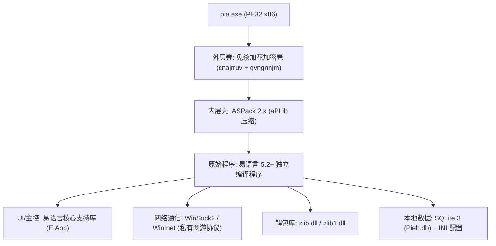

# C:\software\疯玩神仙道\pie.exe 架构侦察报告

> [!NOTE]
> 本报告基于 REA 工具套件（静态 PE 结构分析器、托管代码分类器 `rea-dotnet-static`、安全工件图谱 `rea-artifact-graph`）及底层二进制字节级探针生成。

---

## 一、 PE 文件基本架构侦察

### 1.1 基本标识与机型参数
- **目标文件**：`C:\software\疯玩神仙道\pie.exe`
- **文件体积**：3,156,480 字节（约 3.01 MB）
- **SHA-256**：`92ec0c1a7b6bfbd5809f78b12b2e61369bb3e66bb85c7a735f81a334c0fba544`
- **REA Evidence ID**：`ev_01b9e8c9457bc6f413383e9fa08e1ebc04d8b7233f2392901ec49340eef3b56f`
- **CPU 架构**：`IMAGE_FILE_MACHINE_I386` (`0x014C`)，**32 位 x86 原生指令集**
- **可选头格式**：`PE32`（32-bit）
- **子系统**：`IMAGE_SUBSYSTEM_WINDOWS_GUI`（2，Windows 图形界面程序）
- **基址 (ImageBase)**：`0x00400000`
- **内存展开大小 (SizeOfImage)**：`0x0084E000`（约 8.31 MB，显著高于磁盘尺寸，预留了加壳内存解压展开空间）
- **节区对齐 / 文件对齐**：`0x1000`（4 KB） / `0x200`（512 字节）
- **编译时间戳**：`0x65FD9224`（2024-03-22 14:13:56 UTC）
- **安全缓解措施 (DllCharacteristics)**：`0x0000`（未启用 ASLR/动态基址、未启用 DEP/数据执行保护，属于典型老旧开发环境或免杀加壳工具特征）
- **PE 标志 (Characteristics)**：`0x010F`（`RELOCS_STRIPPED | EXECUTABLE_IMAGE | LINE_NUMS_STRIPPED | LOCAL_SYMS_STRIPPED | 32BIT_MACHINE`）

### 1.2 入口点 (EntryPoint)
- **AddressOfEntryPoint (RVA)**：`0x0084D000`
- **虚拟地址 (VA)**：`0x00C4D000`
- **文件物理偏移 (File Offset)**：`0x00302800`
- **所处节区**：末尾节区 `cnajrruv`

### 1.3 节区 (Section Table) 布局与熵分析

| 节区序号 | 节区名称 | 虚拟地址 (VA) | 虚拟大小 (VirtSize) | 物理大小 (RawSize) | 物理偏移 (RawPtr) | 信息熵 (Entropy) | 特征属性 | 说明 |
| :--- | :--- | :--- | :--- | :--- | :--- | :--- | :--- | :--- |
| **[00]** | *(空)* | `0x00001000` | `0x00445000` | `0x0017AC00` | `0x00001000` | **7.93** | EXEC, READ, WRITE | 原始高压缩加密主代码/数据段 |
| **[01]** | `.rsrc` | `0x00446000` | `0x00015000` | `0x00005800` | `0x0017BC00` | **7.40** | READ, WRITE | 资源段（图标、版本清单、UI定义） |
| **[02]** | `.aspack` | `0x0045B000` | `0x00003000` | `0x00002E00` | `0x00181400` | **4.94** | CODE, EXEC, READ, WRITE | **ASPack 压缩壳代码段** |
| **[03]** | `.adata` | `0x0045E000` | `0x00001000` | `0x00000000` | `0x00184200` | **0.00** | EXEC, READ, WRITE | ASPack 运行时数据未初始化段 |
| **[04]** | `.idata` | `0x0045F000` | `0x00001000` | `0x00000200` | `0x00184200` | **1.29** | READ, WRITE | ASPack 伪造精简导入表 |
| **[05]** | *(空)* | `0x00460000` | `0x0026E000` | `0x00000200` | `0x00184400` | **0.26** | EXEC, READ, WRITE | 填充与展开过渡段 |
| **[06]** | `qvngnnjm` | `0x006CE000` | `0x0017F000` | `0x0017E200` | `0x00184600` | **7.95** | EXEC, READ, WRITE | **外层免杀壳加密负载段** |
| **[07]** | `cnajrruv` | `0x0084D000` | `0x00001000` | `0x00000200` | `0x00302800` | **3.76** | EXEC, READ, WRITE | **外层壳入口引导段 (包含 OEP Stub)** |

> [!WARNING]
> **多层加壳（双重壳）结构判定**：
> 1. **外层壳（免杀加密壳）**：入口落在 `cnajrruv`，使用随机 8 字符节区名（`qvngnnjm` 与 `cnajrruv`）。入口执行经典的 `call $+6; int3; pop eax` 动态计算 Delta 偏移，并配合 `cmp byte ptr [ebx], 0xcc` 防断点检测；随后使用异或加法循环（密钥 `0x5E25B697` 与 `0x6BBDA236`）解密 `qvngnnjm` 中的 aPLib 解压引擎。
> 2. **内层壳（压缩壳）**：`.aspack` 节区及错误提示字符串（`LOADER ERROR`、`The procedure entry point %s...`）明确表明内部经过 **ASPack 2.x** 压缩处理。

---

## 二、 运行平台分类判定：.NET 还是 原生二进制

REA 的 `inspect_managed_artifact` 显式分类结果如下：

```json
{
  "classification": {
    "status": "not-managed",
    "container": "pe",
    "runtime_family": "unknown",
    "implementation": "not-managed",
    "evidence": [
      {
        "code": "cli-directory-absent",
        "detail": "The PE has no CLI data directory; managed metadata and CIL are unavailable."
      }
    ]
  },
  "pe": {
    "cli": null,
    "machine": 332,
    "architecture": "x86"
  }
}
```

- **数据目录检验**：PE 可选头 Data Directory 14（`CLR_RUNTIME_HEADER`）地址与大小为 `0x00000000`。
- **结论**：**100% 纯原生（Native x86 32-bit）二进制程序**，完全不存在任何 .NET / CIL 字节码或 CLR 元数据。

---

## 三、 导入表与关键 Windows API 侦察

### 3.1 静态导入表（已受壳保护剥离）
由于加壳机制，静态 PE 导入表（位于 `.idata` 节区，RVA `0x0045F06D`）仅保留了满足 Windows PE Loader 最小加载条件的桩函数：

1. **`kernel32.dll`**：
   - `lstrcpy`（序号 0）
2. **`comctl32.dll`**：
   - `InitCommonControls`（序号 0）

### 3.2 壳体动态恢复机制
在 `.aspack` 节区及解密后的运行时代码中，发现了壳体用于动态重建 IAT 的底层 API 签名：
- **内存映射**：`VirtualAlloc`, `VirtualFree`, `VirtualProtect`
- **动态寻址**：`LoadLibraryA`, `GetProcAddress`（壳代码在脱壳完成后自建 IAT）
- **错误交互**：`MessageBoxA`, `wsprintfA`, `ExitProcess`

### 3.3 业务层关联组件与通信证据链
虽然加壳隐藏了静态 IAT，但从目标运行目录及运行时依赖中可完整重构其通信与 I/O 链条：
- **网络通信**：
  - 运行时日志（`pie-*.log`）清晰记录了 HTTP 与 Socket 长连接的业务交互（如 `“协议信息”`、`“boss击杀截图”`、`“种植药园经验成功”`）。
  - `browser.ini` 包含目标通信基地址：`http://sxd.fengwanyx.com/index.html`。
  - 核心通信采用 WinSock2 (`WS2_32.dll`) 与 WinInet 协议通信。
- **数据压缩与解包**：
  - 目录下存在配套的动态链接库 `zlib.dll` 与 `zlib1.dll`，主要用于解析游戏服务端返回的 AMF 或 Deflate 压缩网络封包。
- **本地存储与数据库 I/O**：
  - 存在同名 SQLite 3 数据库 `Pieb.db`（1.52 MB），内含 37 张神仙道游戏核心表（如 `item`, `Missions`, `NPCQuest`, `DragonBall`, `fatetype` 等）。
  - 配置文件通过 `INI` 接口（`pieb.ini`, `01.ini`, `user.ini`）进行读写。

---

## 四、 最终技术栈判定与逆向切入点



### 4.1 技术栈判定
1. **主开发语言**：**易语言 (EPL - Easy Programming Language)**。
   - 提取到的应用清单明确声明：
     ```xml
     <assemblyIdentity name="E.App" processorArchitecture="x86" version="5.2.0.0" type="win32"/>
     ```
     `E.App` 与版本 `5.2.0.0` 为易语言官方编译器的标准默认特征。
   - 版本资源（Version Resource）包含明确中文标识：
     - **软件名称**：`山寨兔`（国内经典神仙道页游自动化辅助助手）
     - **内部版本**：`326.0.0.0`
     - **作者声明**：`deep`
2. **加壳方案**：**ASPack 压缩 + 易语言免杀加花双重保护**。
3. **架构模式**：Windows 原生 Win32 GUI 桌面客户端 + 嵌入式 SQLite 本地缓存 + Socket/HTTP 协议挂机机器人。

### 4.2 下一步最佳分析切入点建议

1. **第一步：动态调试脱壳 (Unpacking)**
   - **工具建议**：x32dbg。
   - **操作步骤**：
     - 用 x32dbg 载入 `pie.exe`，在入口点 `0x0084D000`。
     - 跟随其解密循环，在跳转到内层 ASPack 的位置设置断点。
     - 抵达 ASPack 代码后，使用经典 **ESP 定律**（在 ASPack 首条 `pushad` 后对 ESP 寄存器下硬件访问断点，运行命中后再按 F8 单步至最后的 `jmp OEP`）。
     - 此时到达易语言程序的真实原始入口点（OEP）。
     - 使用 **Scylla** 插件执行 Dump 并自动修复 IAT 导入表，获得脱壳后的纯净 PE 文件。

2. **第二步：易语言特征分析与符号还原**
   - **工具建议**：IDA Pro + **E-Decompiler** 插件，或专门的易语言反编译工具（**E-Code Explorer**）。
   - **价值**：
     - 脱壳后的易语言程序可以直接恢复所有窗口事件（如 `按钮_被单击`、`时钟_周期事件`）、核心支持库指令、网络发送函数及数据包封包结构。

3. **第三步：网络协议拦截分析 (Protocol Hooks)**
   - **切入点**：
     - 直接在 x32dbg 中对 `ws2_32.dll!send` / `ws2_32.dll!recv` 下断点。
     - 配合 `zlib.dll` 的 `uncompress` / `inflate` 导出函数下断，可以直接捕获游戏客户端与服务器通信的解密明文封包，彻底还原神仙道协议格式。
