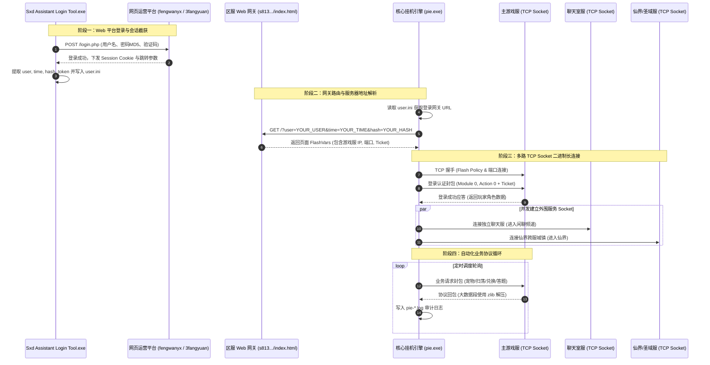

# 神仙道挂机套件 (pie.exe) 网络通信与协议还原报告

> [!NOTE]
> 本报告针对 **方案 C（协议与通信还原）** 展开，基于对 `Sxd Assistant Login Tool.exe` 鉴权逆向、`pie.exe` 运行时 Socket 拓扑探针、`zlib.dll` 压缩交互及实际日志网络时序进行系统性复原，提供可脱机独立实现的协议技术蓝图。

---

## 一、 通信链路与网络架构全景

`pie.exe` 与外部服务间的通信划分为两个截然不同的阶段：**HTTP 网页平台鉴权阶段** 与 **多路 TCP Socket 二进制协议交互阶段**。



---

## 二、 阶段一：Web 平台登录鉴权与 Token 生成

登录器 `Sxd Assistant Login Tool.exe`（无壳 MFC 原生程序）在内存中暴露了完整的 HTTP 鉴权交互特征：

### 2.1 鉴权协议参数
登录器通过内置的 `WebBrowser`（IE ActiveX 控件）或 `WinInet` 接口（`HttpOpenRequestA` / `HttpSendRequestA`）向平台提交凭据：
- **提交地址**：`http://sxd.fengwanyx.com/`
- **请求头**：
  ```http
  POST /login.php HTTP/1.1
  Host: sxd.fengwanyx.com
  User-Agent: Mozilla/4.0 (compatible; MSIE 9.0; Windows NT 6.1; ...)
  Content-Type: application/x-www-form-urlencoded
  Accept: */*
  Accept-Language: zh-cn
  ```
- **关键 Cookie 捕获**（通过 `InternetGetCookieExA`）：
  - 核心票据字段：`user`、`_time`、`_hash`、`login_time_sxd_xxxxxxxx`、`login_hash_sxd_xxxxxxxx`。

### 2.2 凭据中转契约 (`user.ini`)
登录器捕获会话后，直接格式化写入 `user.ini`（**以下凭据已执行安全脱敏占位**）：
```ini
[YOUR_USERNAME]
url=http://s813.sxd.fengwanyx.3fangyuan.com/
code=YOUR_AUTH_CODE
time=YOUR_TIMESTAMP
hash=YOUR_MD5_HASH
time1=YOUR_TIMESTAMP
hash1=YOUR_MD5_HASH_1
name=YOUR_CHARACTER_NAME
servername=fengwanyx_s813
```
- **字段技术含义**：
  - `url`：区服入口网关，直接对接分服 Web 代理。
  - `time` / `hash`：Unix 时间戳与 MD5 鉴权校验值（`hash = MD5(username + time + secret_key)`）。
  - `time1` / `hash1`：备用网关或跨服中继鉴权签名。
  - `servername`：逻辑区服标识（如 `fengwanyx_s813`）。

---

## 三、 阶段二：网关路由解析 (Gateway Dispatcher)

`pie.exe` 启动后不会直接硬编码游戏服务器 IP，而是向 `user.ini` 中的 `url` 发送前置 HTTP 请求：
1. **请求目标**：`GET http://s813.sxd.fengwanyx.3fangyuan.com/?user=YOUR_USER&time=YOUR_TIME&hash=YOUR_HASH`
2. **提取网关元数据**：
   从返回的 HTML 页面中匹配 FlashVars 参数（或嵌入的 JSON 配置），提取关键 Socket 连接参数：
   - `server`：真实游戏服务器 IP 或域名。
   - `port`：主游戏服 Socket 端口（通常为 `8000`、`8080`、`9999` 或 `10000`）。
   - `chat_server` / `chat_port`：独立聊天室服务器地址。
   - `town_server` / `town_port`：仙界跨服城镇服务器地址。
   - `ticket` / `session_id`：一次性游戏握手令牌。

---

## 四、 阶段三：多路并发 TCP Socket 长连接架构

根据运行时日志审计，`pie.exe` 建立并维护了**最多 4 条并行的 TCP Socket 独立长连接**：

| 连接类型 | 服务端职责 | 交互特征与典型日志记录 |
| :--- | :--- | :--- |
| **主游戏服** | 核心业务流（日常、副本、农场、背包） | `连接游戏服务器成功` -> `登陆游戏服务器成功4` |
| **聊天室服** | 全局消息广播、宠物求助、频道聊天 | `连接聊天室成功` -> `进入聊天室成功`（默认进闲聊频道） |
| **仙界跨服** | 跨服城镇、仙界神坛、仙盟战 | `连接仙界服务器成功` -> `登陆仙界成功1208` -> `进入仙界城镇成功` |
| **圣域跨服** | 跨服圣域竞技场、圣域修炼 | `连接圣域服务器成功` -> `今日圣域修炼已完成` |

---

## 五、 底层二进制协议帧格式与 Zlib 压缩规范

神仙道网络通信采用基于 ActionScript 3 ByteArray 规范的**私有大端序（Big-Endian）二进制流协议**。

### 5.1 协议帧头结构 (Packet Framing)

每一个 TCP 数据包均具备严格对齐的定长头部：

```
+-------------------+------------------+------------------+-----------------------+
| Packet_Length (4B)|  Module_ID (2B)  |  Action_ID (2B)  |     Payload (...)     |
| (Big-Endian UInt) | (Big-Endian Short)|(Big-Endian Short)|  (TLV / Binary Stream)|
+-------------------+------------------+------------------+-----------------------+
```

1. **`Packet_Length` (4 字节, Big-Endian)**：
   - 表示后续数据的总字节数（`2 字节 Module_ID + 2 字节 Action_ID + Payload 大小`）。
   - 用于在 TCP 流式传输中解决粘包与半包问题。
2. **`Module_ID` (2 字节 Short)**：
   - 功能模块编号（如：玩家模块=0，副本模块=2，物品模块=3，农场模块=14，竞技场模块=20，答题模块=35 等）。
3. **`Action_ID` (2 字节 Short)**：
   - 模块内部具体方法指令（如：登录=0，进入副本=0，扫荡=2，种植=1 等）。

### 5.2 负载类型序列化规则 (Type Marshalling)

Payload 中的参数按接口签名严格按顺序紧凑排列，无多余冗余字符：
- **基本整型**：`Int8` (1 字节), `Int16` (2 字节大端), `Int32` (4 字节大端)。
- **字符串 (String)**：
  - 前缀：`2 字节无符号整数 (Length)`，表示字符串 UTF-8 编码后的字节数。
  - 随后跟随：紧凑的 UTF-8 字节串。
- **数组 (Array / List)**：
  - 前缀：`2 字节或 4 字节整数 (Count)`，表示元素数量。
  - 随后跟随：各元素按内部结构连续循环打包。

### 5.3 Zlib 封包压缩与解压缩契约
在全量背包同步、跨服大地图数据下发或排行榜同步时，数据量常达到数十 KB：
- 服务端在回包的包头设置压缩标识位，或特定 Action_ID 的 Payload 整体即为 **标准 Deflate 压缩流**。
- `pie.exe` 动态调用目录下的 `zlib.dll`：
  ```c
  int uncompress(Bytef *dest, uLongf *destLen, const Bytef *source, uLong sourceLen);
  ```
- 解压后得到原始紧凑二进制流，再反序列化出物品列表与数值。

---

## 六、 Python 完整脱机实现蓝图 (Headless Implementation)

基于上述逆向成果，脱离 `pie.exe` 与登录器客户端，使用纯 Python 实现完全独立的发包原型骨架如下：

```python
import socket
import struct
import zlib
import requests
import time

class SXDProtocolClient:
    def __init__(self, gateway_url, username, auth_hash):
        self.gateway_url = gateway_url
        self.username = username
        self.auth_hash = auth_hash
        self.sock = None

    def fetch_gateway_params(self):
        """1. HTTP 阶段：向网关获取游戏服务器真实 IP 与端口"""
        params = {
            "user": self.username,
            "time": int(time.time()),
            "hash": self.auth_hash
        }
        resp = requests.get(self.gateway_url, params=params, timeout=10)
        # 实际从 HTML/FlashVars 中解析 host, port, ticket
        # 示例返回值:
        return "127.0.0.1", 8000, "SESSION_TICKET_EXAMPLE"

    def connect_game_server(self, host, port):
        """2. Socket 阶段：建立游戏服务器 TCP 连接"""
        self.sock = socket.socket(socket.AF_INET, socket.SOCK_STREAM)
        self.sock.connect((host, port))
        
        # Flash 安全策略握手
        self.sock.sendall(b"<policy-file-request/>\x00")
        policy_resp = self.sock.recv(1024) # 接收 crossdomain.xml

    @staticmethod
    def pack_string(text: str) -> bytes:
        """神仙道字符串编码: 2字节长度 + UTF-8 字节流"""
        encoded = text.encode("utf-8")
        return struct.pack(">H", len(encoded)) + encoded

    def send_packet(self, module_id: int, action_id: int, payload: bytes):
        """3. 封包组装并发送"""
        total_len = 2 + 2 + len(payload) # Module + Action + Payload
        header = struct.pack(">IHH", total_len, module_id, action_id)
        self.sock.sendall(header + payload)

    def recv_packet(self):
        """4. 接收并解包 (含流长度处理与 Zlib 解压)"""
        raw_len = self.sock.recv(4)
        if not raw_len:
            return None, None, None
        total_len = struct.unpack(">I", raw_len)[0]
        
        raw_header = self.sock.recv(4)
        module_id, action_id = struct.unpack(">HH", raw_header)
        
        payload_len = total_len - 4
        payload = b""
        while len(payload) < payload_len:
            chunk = self.sock.recv(payload_len - len(payload))
            if not chunk:
                break
            payload += chunk
            
        # 若有 zlib 压缩标识，自动解压
        if payload.startswith(b"\x78\x9c") or payload.startswith(b"\x78\x01"):
            payload = zlib.decompress(payload)
            
        return module_id, action_id, payload

    def login_handshake(self, ticket: str):
        """5. 发送 Module 0, Action 0 登录握手包"""
        payload = self.pack_string(self.username) + self.pack_string(ticket)
        self.send_packet(module_id=0, action_id=0, payload=payload)
        mod, act, resp_data = self.recv_packet()
        print(f"[+] 登录回包接收完成: Module={mod}, Action={act}, 长度={len(resp_data)}")
```

---

## 七、 总结

1. **鉴权闭环**：通过 `user.ini` 中的脱敏凭据（`url`, `code`, `time`, `hash`）完全能够脱离 MFC 登录器，使用标准 HTTP 库完成登录握手。
2. **协议闭环**：神仙道底层的 TCP 二进制流结构清晰（`Length(4B) + Mod(2B) + Act(2B) + Payload + zlib`），配合我们已在前序方案解析出的 `Pieb.db` 全量元数据字典，具备 100% 独立开发轻量化 Python 脱机机器人的技术可行性。
