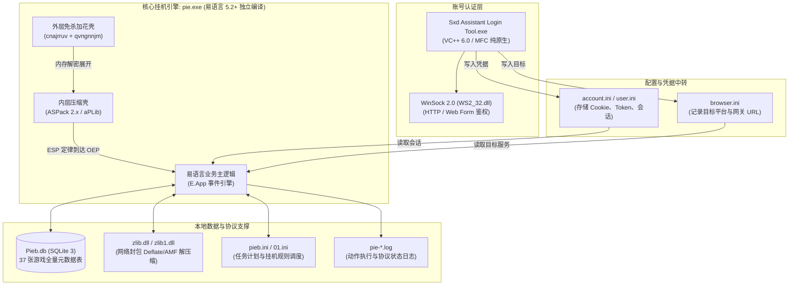

# 疯玩神仙道挂机套件 (pie.exe) 深度逆向与脱壳实战手册

> [!NOTE]
> 本手册紧接前序架构侦察成果，对 `pie.exe` 及其配套工具链（`Sxd Assistant Login Tool.exe`、`Pieb.db`、`zlib.dll`）展开系统级逆向推演，提供可直接落地的脱壳步骤、易语言反编译方案与协议还原路径。

---

## 一、 套件模块协同全景架构

通过对目录全量组件的交叉扫描，该工具并非孤立程序，而是一套典型的“登录鉴权 + 脱机协议挂机 + 本地数据驱动”的完整页游自动化系统：



---

## 二、 双重壳脱壳实战手册 (Step-by-Step)

针对 `pie.exe` 的外层免杀壳与内层 ASPack，推荐使用 **x32dbg** 进行动态调试脱壳。

### 2.1 突破第 1 层：外层免杀壳
- **初始断点**：程序初始停在 EntryPoint：`0x0084D000`。
- **关键汇编特征**：
  ```asm
  0x0084D000: push esi
  0x0084D001: push eax
  0x0084D002: push ebx
  0x0084D003: call 0x0084D009
  0x0084D008: int 3                ; Anti-debug 探针
  0x0084D009: pop eax              ; 动态获取返回地址
  ...
  0x0084D01C: cmp byte ptr [ebx], 0xcc
  0x0084D01F: jne 0x0084D03A
  0x0084D021: mov byte ptr [ebx], 0; 抹除 int 3 标志
  0x0084D024: mov ebx, 0x1000
  0x0084D029: push 0x6BBDA236      ; 解密 Key 2
  0x0084D02E: push 0x5E25B697      ; 解密 Key 1
  0x0084D033: push ebx             ; 大小 0x1000
  0x0084D034: push eax             ; 目标地址 0x006CE000
  0x0084D035: call 0x0084D044      ; 执行 XOR + ADD 解密
  0x0084D03D: mov [esp + 8], eax   ; 将返回地址替换为 0x006CE000
  0x0084D043: ret                  ; 弹出并跳转至 0x006CE000
  ```
- **脱壳动作**：
  1. 在 `0x0084D043`（`ret`）处下断点（F2），按 F9 运行。
  2. 命中后按 F7 单步一次，执行流进入 `0x006CE000`。
  3. 在 `0x006CE000` 处，代码执行 aPLib 解压引擎，将压缩数据展开至 `0x00460014`。在 `0x006CE20D`（`jmp 0x00460014`）处下断点并运行。
  4. 单步进入 `0x00460014`，跟随其长跳转即可直接进入内层 **ASPack 壳体首部**（通常在 `.aspack` 节区 `0x0045B001`）。

### 2.2 突破第 2 层：内层 ASPack 压缩壳 (ESP 定律)
- **原理**：ASPack 在加载时首先保存所有寄存器现场（`pushad`），解压完原代码并填充 IAT 后，恢复寄存器（`popad`），紧接着跨段长跳转到真实 OEP。
- **脱壳动作**：
  1. 抵达 `.aspack` 节区（第一条指令为 `pushad`）。
  2. 单步按 F7 执行该条 `pushad`。
  3. **下硬件访问断点**：观察右侧寄存器窗口中的 `ESP` 值，在内存窗口或命令行输入：
     `hw [[esp]]` 或直接在寄存器窗口右键 `ESP -> 在内存窗口中转到 -> 右键下硬件访问断点 (DWORD)`。
  4. 按 F9 继续运行程序。
  5. 硬件断点命中，光标精准停在 `popad` 之后的指令附近。
  6. 此时连续按 F8 单步步过数次，会看到一条跨越节区的大跳转指令（如 `jmp 0x0040XXXX` 或 `push 0x0040XXXX; ret`）。
  7. 执行该跳转，光标停在的地址即为 **易语言程序的真实入口点 (OEP)**！

### 2.3 内存 Dump 与 IAT 修复
1. 打开 x32dbg 内置的 **Scylla** 插件（菜单栏 `插件 -> Scylla`）。
2. 在 `OEP` 输入框中填入刚刚到达的真实 OEP 地址（RVA 形式）。
3. 点击 **IAT Autosearch**（自动搜索 IAT），再点击 **Get Imports**（获取导入函数）。
4. 检查导入函数列表（Valid: 100%）。如果有少量无效指针，直接右键 `Cut Thunk` 裁剪。
5. 点击 **Dump**，将当前解密后的内存进程保存为 `pie_dump.exe`。
6. 点击 **Fix Dump**，选择刚生成的 `pie_dump.exe`，生成修复好 IAT 的最终纯净文件 `pie_dump_SCY.exe`。

---

## 三、 易语言程序特征定位与反编译方案

脱壳生成的 `pie_dump_SCY.exe` 是标准的易语言独立编译程序。

### 3.1 易语言核心特征结构
易语言独立编译时会将核心支持库（`krnln.fnr`、`spec.fnr` 等）静态内联至 PE 代码段中：
1. **窗口与事件分发链**：
   - 易语言的按钮点击、时钟触发、窗口创建均通过统一的事件分发函数调度。
   - 寻找消息分发循环特征码：`8B 44 24 04 85 C0 74 ...`，可快速定位所有按钮事件处理函数地址表。
2. **文本与数组管理**：
   - 易语言的文本采用 Pascal 风格与 C 风格混合的内存块（长度前缀+零结尾），全局常量字符串通常集中存放在一个只读数据表中。

### 3.2 推荐专用分析工具链
- **IDA Pro + E-Decompiler 插件**：
  - 能自动重命名易语言核心库函数（如 `读配置项`、`写配置项`、`取文本中间`、`发送数据`、`连接`、`执行SQL`）。
  - 能将事件回调函数自动命名为 `窗口1_按钮1_被单击`、`时钟1_周期事件` 等直观中文名称。
- **E-Code Explorer (易语言代码分析器)**：
  - 支持直接解析易语言编译后的资源表与代码段，将函数还原为易语言层级的树状结构。

---

## 四、 本地数据库 `Pieb.db` 全量业务表拓扑

`pie.exe` 挂机运行高度依赖本地 SQLite 数据库 `Pieb.db`（1.52 MB）。其内含的 37 张表构成了游戏协议自动化的本地知识库：

| 表分类 | 包含数据表 | 挂机自动化业务用途 |
| :--- | :--- | :--- |
| **角色与伙伴** | `roletype`, `RoleScrapInfos`, `cardSoulList`, `PartnerExpeditionmission` | 伙伴招募、角色进阶、伙伴远征任务匹配 |
| **关卡与地图** | `Missions`, `hidemap`, `NPCQuest`, `NPCposition`, `Mapkey` | 自动寻路 NPC 坐标、隐藏副本扫描、关卡快速扫荡 |
| **装备与物品** | `item`, `factureReel`, `FiveElementsEquip`, `DragonBall`, `fatetype` | 自动配装、卷轴合成材料计算、五行装备洗练、命格吞噬 |
| **商店与兑换** | `yupaishop`, `daoyuanshop`, `luckyshop`, `StShanhaiShop`, `newShopGoods`, `WorldPKExchange` | 玉牌商店自动抢购、道源商店定时刷新购买、跨服战积分兑换 |
| **日常活动奖励** | `TowerAwardList`, `wishpoolaward`, `IdentifyTreasureaward`, `StEightImmortalsType`, `ActivityArray`, `Furinkazan` | 爬塔奖励结算、许愿池奖励判定、八仙过海副本、风林火山活动调度 |

---

## 五、 协议脱机与网络交互实战路径

### 5.1 登录流程还原 (`Sxd Assistant Login Tool.exe`)
- 登录器采用标准 MFC + WinSock，不加壳。
- **分析方式**：直接用 x32dbg 或 IDA 载入 `Sxd Assistant Login Tool.exe`，对 `WS2_32.dll` 的 `connect` 和 `send` 下断点，抓取向平台发送的 HTTP POST 登录参数（账号、密码 MD5/RSA、验证码参数），即可完全重构自动化登录脚本。

### 5.2 挂机协议解密与还原 (`pie.exe` + `zlib.dll`)
神仙道游戏服务端与客户端通信通常采用基于 TCP 的二进制协议封包（包含包头长度、协议号、AMF 序列化数据，且普遍使用 zlib 压缩）：
1. **封包拦截点**：
   - 在 x32dbg 中对 `pie.exe` 下断点：`bp ws2_32.send` 与 `bp ws2_32.recv`。
2. **明文解压点**：
   - 对配套的 `zlib.dll` 导出函数 `uncompress` 或 `inflate` 下断点：
     ```
     bp zlib.uncompress
     ```
   - 此时堆栈第二参数即为解压缩后的目标缓冲区地址，**此处能直接截获游戏服务端下发的完整明文协议数据**。
3. **协议重放与自动化**：
   - 结合日志文件 `pie-*.log` 中的动作记录（例如 `[15:06:30] 种植药园经验成功`、`[15:09:55] 协议信息`），将断点处捕获的协议号与日志记录进行时间对齐，即可逐条逆向出各玩法的协议号与数据格式，实现脱机自动化。
