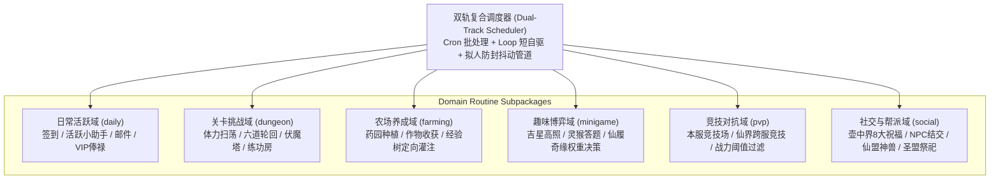
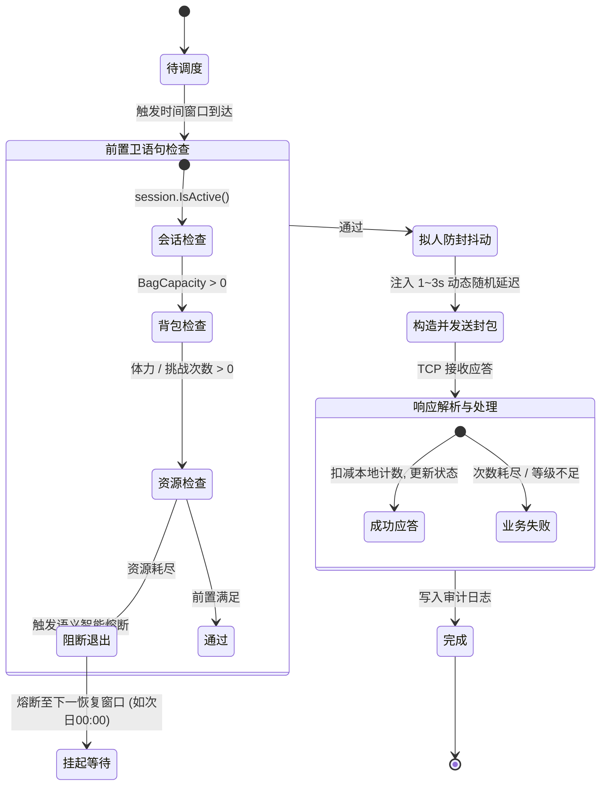

# 玩法子系统与自动化规则规范白皮书 (Routine Specification)

> [!NOTE]
> 本白皮书全面对齐原版 `pieb.ini`（23 个核心玩法子系统）与 `01.ini` 的调度逻辑，定义六大领域包（`daily`, `dungeon`, `farming`, `minigame`, `pvp`, `social`）中具体玩法的状态机生命周期、前置卫语句检查、发包时序与语义智能熔断契约。

---

## 一、 领域包与玩法架构映射矩阵



| 领域包名称 | 对应目录 | 覆盖原版 `pieb.ini` 玩法模块 | 调度类型 | 优先级 |
| :--- | :--- | :--- | :--- | :--- |
| **`daily`** | `internal/routines/daily` | `[日常]` 签到、小助手、邮件、VIP俸禄、称号 | `ScheduleCron` (00:00, 06:02) | High / Normal |
| **`dungeon`** | `internal/routines/dungeon` | `[动作] 扫荡`、`[01.ini 扫荡]` 关卡体力扫荡 | `ScheduleLoop` (30m 周期) | Normal |
| **`farming`** | `internal/routines/farming` | `[农场]` 土地种植、作物收获、伙伴灌注 | `ScheduleLoop` (15m 周期) | Normal |
| **`minigame`** | `internal/routines/minigame` | `[日常] 吉星高照`、`[01.ini 仙履奇缘]`、灵猴问答 | `ScheduleCron` (12:00, 18:01) | Normal / Low |
| **`pvp`** | `internal/routines/pvp` | `[日常] 本服竞技场`、`[圣域竞技]`、`[神魔大战]` | `ScheduleCron` (12:00, 20:01) | Normal |
| **`social`** | `internal/routines/social` | `[壶中界]`、`[仙盟]`、`[圣盟]`、`[结婚]`、`[取经]` | `ScheduleCron` (08:02, 22:01) | High / Normal |

---

## 二、 核心任务状态机与生命周期标准

所有日常活动任务必须严格遵循统一的状态机流转，禁止跳过前置卫语句检查：



### 2.1 语义智能熔断机制 (Semantic Cooling-off)
- **拒绝无谓重试**：当执行中服务端返回特定错误码（例如：`体力不足`、`今日挑战次数已用完`、`等级未达到解锁要求`）时，该 Routine 必须立即进入 **语义智能熔断状态**。
- **自动对齐恢复窗口**：系统将任务挂起至下一个逻辑重置时间点（如次日 `00:00`，或根据体力回复速率计算的具体时刻），而非在短时间内频繁重试消耗带宽与触发防挂检测。

### 2.2 拟人防封随机抖动 (Jitter Pipeline)
- 每次与服务端发起核心交互前，必须穿透调用 `jitter.Wait(ctx)`。
- 在 `configs/config.yaml` 中配置抖动区间（默认 `min: 1.0s, max: 3.0s`），利用泊松或高斯分布生成不可预测的操作间隔。

---

## 三、 六大核心玩法子系统实战规范

### 3.1 副本体力扫荡 (`dungeon_sweep`)
- **调度策略**：`ScheduleLoop`，每 30 分钟轮询一次。
- **前置检查**：
  1. `session.GetStamina() >= 5`（单次关卡基础体力消耗为 5 点）。
  2. `session.GetPlayerState().BagCapacity > 0`（防止背包满导致掉落装备损毁）。
- **关卡寻址算法**：
  1. 若配置中指定了 `TargetMissionID`，优先扫荡该关卡；
  2. 若未指定，查询本地数据库 `Pieb.db` 中的 `Missions` 表，按 `01.ini` 的 `从高等级扫起=是` 选取当前等级允许的最高收益 BOSS 关卡。
- **发包时序**：
  1. 发送 `Module 25, Action 1 (0x00190001)` 发起扫荡；
  2. 解析回包扣减本地体力记录。若体力不足，触发熔断挂起。

### 3.2 药园农场 (`herb_garden`)
- **调度策略**：`ScheduleLoop`，每 15 分钟巡视一次。
- **发包时序**：
  1. **查询状态**：发送 `Module 13, Action 0 (0x000D0000)`，获取 6 块土地的成熟计时；
  2. **收获作物**：遍历所有成熟土地，依次发送 `Module 13, Action 25 (0x000D0019)`；
  3. **重新种植**：对空闲土地，读取 `pieb.ini [农场]` 配置的种子优先级（经验丹果树、奇异果树、道源果树），并指派配置中的主力伙伴（如神夸父、伏羲等），发送 `Module 13, Action 24 (0x000D0018)`。

### 3.3 仙履奇缘问答 (`immortal_encounter`)
- **调度策略**：`ScheduleCron`，每日 `12:00` 与 `18:01` 触发。
- **智能决策流**：
  1. 发送 `Module 21, Action 1 (0x00150001)` 触发奇遇事件，获取题目文本；
  2. **三级漏斗检索**：
     - 在 `data/answers.txt` 建立的内存哈希索引中匹配题目标题；
     - 读取 `01.ini [仙履奇缘]` 的收益优先级规则：`体力 > 声望 > 阅历 > 铜钱`；
     - 权衡选项 1 与选项 2 的产出物，计算最优解分支索引；
  3. 发送 `Module 21, Action 2 (0x00150002)` 提交最佳答案。

### 3.4 竞技场挑战 (`arena_challenge`)
- **调度策略**：`ScheduleCron`，对齐每日奖励结算时间（`12:00` 与 `20:01`）。
- **策略过滤**：
  1. 发送 `Module 28, Action 13 (0x001C000D)`，确认剩余挑战次数 > 0；
  2. 发送 `Module 28, Action 0 (0x001C0000)`，拉取当前 5 位候选对手；
  3. **软柿子筛选算法**：根据 `01.ini [仙界竞技场] 对手战力上限`，优先选择排位最靠前、且战斗力低于玩家当前战力的对手；
  4. 发送 `Module 28, Action 1 (0x001C0001)` 发起挑战。

### 3.5 壶中界祝福与结交 (`pot_refinement`)
- **调度策略**：`ScheduleCron`，每日 `08:02` 与 `22:01` 执行。
- **业务动作**：
  1. 维持 8 大核心祝福（取经、宠物、觉醒、虚空、魔石、五行、仙桃、种植祝福）；当剩余有效时间小于 4000 秒时重新炼化；
  2. 自动与 10 位仙界 NPC（土地公、陆吾、柳如烟、月老、芸娘等）批量送礼结交，消耗配置指定的货币（道源）。

---

## 四、 存量代码迁移与接口对接契约

针对现有 `internal/routines/` 中仅包含空日志的半成品，在后续重构推进时统一遵循本契约：

```go
// 规范化打桩示例 (对齐 internal/routines/daily/daily.go)
func NewSignInRoutine() scheduler.ActivityRoutine {
    return scheduler.NewBaseRoutine(
        "daily_sign_in",
        "daily",
        scheduler.ScheduleCron,
        scheduler.PriorityHigh,
        0,
        func(ctx context.Context, session *client.RoleSession, jitter *scheduler.Jitter) error {
            if session == nil {
                return client.ErrNotConnected
            }
            if jitter != nil {
                _ = jitter.Wait(ctx)
            }
            
            // TODO(Ateng): 发送 Module 0, Action 2 确认角色基础属性
            // TODO(Ateng): 发送 Module 0, Action 72 获取每日签到奖励状态并提交签到请求
            slog.Info("正在执行日常任务: 每日签到与在线福利领取", "role_id", session.RoleID())
            return nil
        },
    )
}
```
